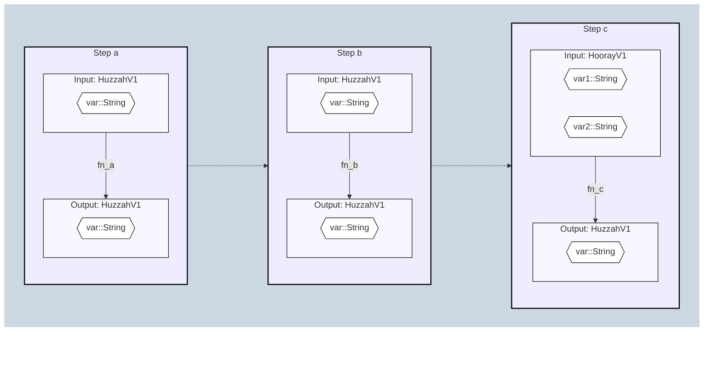

# TransformSpecifications.jl

[](https://beacon-biosignals.github.io/TransformSpecifications.jl/stable)
[](https://beacon-biosignals.github.io/TransformSpecifications.jl/dev)
[](https://github.com/beacon-biosignals/TransformSpecifications.jl/actions/workflows/TransformSpecifications_CI.yml)
[](https://app.codecov.io/gh/beacon-biosignals/TransformSpecifications.jl)

TransformSpecifications.jl provides tools to define explicitly-specified transformation components. Such components can then be used to construct pipelines and DAGs that are themselves composed of individual explicitly-specified components. Additionally, they can be easily wrapped to catch and nicely handle both expected and unexpected specification and transformation violations.

## Basic transform example

A basic `TransformSpecification` is constructed from the input and output specifications and the transformation function to be applied:

```julia
julia> using TransformSpecifications
julia> ts = TransformSpecification(String, Integer, length)

# Valid input
julia> transform!(ts, "greetings")
9

# Invalid input
julia> transform!(ts, 92)
ERROR: ArgumentError: Input doesn't conform to specification `String`
```

A `NoThrowTransform` facilitates the case where a transformation must be robust to unexpected errors---instead of throwing an error, it returns the violation in a `NoThrowResult`:

```julia
julia> ntt = NoThrowTransform(String, Integer, length)

# Valid input:
julia> transform!(ntt, "greetings")
NoThrowResult{Int64}: Transform succeeded
  ✅ result: 9

# Invalid input:
julia> transform!(ntt, 92)
NoThrowResult{Missing}: Transform failed
  ❌ Input doesn't conform to specification `String`. Details: MethodError(convert, (String, 92), 0x0000000000007f48)

# Invalid output (from the transform function) also throws:
julia> ts = NoThrowTransform(String, String, length)
julia> transform!(ts, "foo")
NoThrowResult{Missing}: Transform failed
  ❌ Output doesn't conform to specification `NoThrowResult{String}`; is instead a `NoThrowResult{Int64}`
```

## `NoThrowDAG` example

A `NoThrowDAG` facilitates composing multiple specified transforms (`DAGStep`s) into a [DAG](https://en.wikipedia.org/wiki/Directed_acyclic_graph), such that any errors errors encountered during the application of the DAG will be returned "nicely" (i.e., as a `NoThrowResult` object with the source of failure noted in the `violations` field) rather than thrown as an exception:

```julia
julia> using Legolas: @schema, @version

julia> @schema "one-var" Huzzah
julia> @version HuzzahV1 begin
           var::String
       end

julia> @schema "two-var" Hooray
julia> @version HoorayV1 begin
           var1::String
           var2::String
       end

# Say we have three functions we want to chain together:
julia> fn_a(x::HuzzahV1) = HuzzahV1(; var=x.var * "_a")
julia> fn_b(x::HuzzahV1) = HuzzahV1(; var=x.var * "_b")
julia> fn_c(x::HoorayV1) = HuzzahV1(; var=x.var1 * x.var2 * "_c")

# First, specify these functions as transforms: what is the specification of the
# function's input and output?
julia> step_a_transform = NoThrowTransform(HuzzahV1, HuzzahV1, fn_a)
julia> step_b_transform = NoThrowTransform(HuzzahV1, HuzzahV1, fn_b)
julia> step_c_transform = NoThrowTransform(HoorayV1, HuzzahV1, fn_c)

# Next, set up the DAG between the upstream outputs into each step's input:
julia> step_b_assembler = input_assembler(upstream -> (; var=upstream["step_a"][:var]))
julia> step_c_assembler = input_assembler(upstream -> (; var1=upstream["step_a"][:var],
                                                       var2=upstream["step_b"][:var]))

julia> steps = [DAGStep("step_a", nothing, step_a_transform),
                DAGStep("step_b", step_b_assembler, step_b_transform),
                DAGStep("step_c", step_c_assembler, step_c_transform)]
julia> dag = NoThrowDAG(steps)

# output
NoThrowDAG (HuzzahV1 => HuzzahV1):
  🌱  step_a: HuzzahV1 => HuzzahV1: `fn_a`
   ·  step_b: HuzzahV1 => HuzzahV1: `fn_b`
  🌷  step_c: HoorayV1 => HuzzahV1: `fn_c`

# Call DAG on valid input:
julia> transform!(dag, HuzzahV1(; var="initial_str"))

# output
NoThrowResult{HuzzahV1}: Transform succeeded
  ✅ result: HuzzahV1:
 :var  "initial_str_ainitial_str_a_b_c"

# Call DAG on invalid input:
transform!(dag, HoorayV1(; var1="wrong", var2="input schema"))

# output
NoThrowResult{Missing}: Transform failed
  ❌ Input to step `step_a` doesn't conform to specification `HuzzahV1`. Details: ArgumentError("Invalid value set for field `var`, expected String, got a value of type Missing (missing)")
```

Finally, a diagram for the DAG can be generated as a [mermaid](https://mermaid.js.org/) plot:
```julia
mermaidify(dag)
```
which renders automatically when included in a `mermaid` markdown block in GitHub:


For more TransformSpecification.jl details and examples, see [the documentation](https://beacon-biosignals.github.io/TransformSpecifications.jl/stable)!
