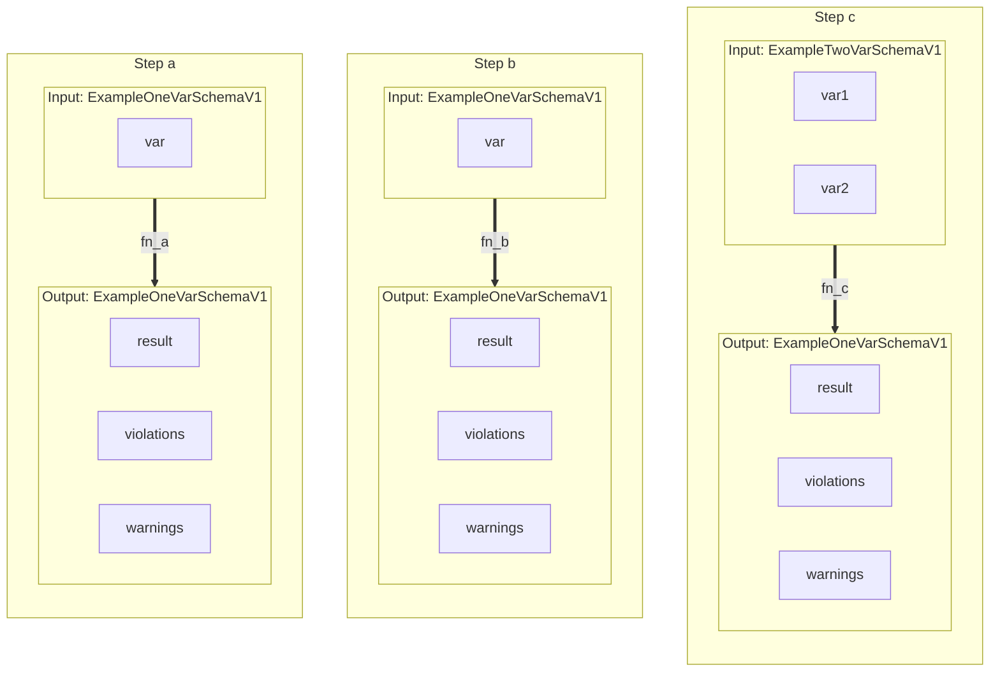

```mermaid
flowchart LR

%% Add steps (nodes)
subgraph STEP_A[Step a]
  direction TB
  subgraph STEP_A_InputSchema[Input: ExampleOneVarSchemaV1]
    direction RL
    STEP_A_InputSchemavar[var]
  end
  subgraph STEP_A_OutputSchema[Output: ExampleOneVarSchemaV1]
    direction RL
    STEP_A_OutputSchemaresult[result]
    STEP_A_OutputSchemaviolations[violations]
    STEP_A_OutputSchemawarnings[warnings]
  end
  STEP_A_InputSchema == fn_a ==> STEP_A_OutputSchema
end
subgraph STEP_B[Step b]
  direction TB
  subgraph STEP_B_InputSchema[Input: ExampleOneVarSchemaV1]
    direction RL
    STEP_B_InputSchemavar[var]
  end
  subgraph STEP_B_OutputSchema[Output: ExampleOneVarSchemaV1]
    direction RL
    STEP_B_OutputSchemaresult[result]
    STEP_B_OutputSchemaviolations[violations]
    STEP_B_OutputSchemawarnings[warnings]
  end
  STEP_B_InputSchema == fn_b ==> STEP_B_OutputSchema
end
subgraph STEP_C[Step c]
  direction TB
  subgraph STEP_C_InputSchema[Input: ExampleTwoVarSchemaV1]
    direction RL
    STEP_C_InputSchemavar1[var1]
    STEP_C_InputSchemavar2[var2]
  end
  subgraph STEP_C_OutputSchema[Output: ExampleOneVarSchemaV1]
    direction RL
    STEP_C_OutputSchemaresult[result]
    STEP_C_OutputSchemaviolations[violations]
    STEP_C_OutputSchemawarnings[warnings]
  end
  STEP_C_InputSchema == fn_c ==> STEP_C_OutputSchema
end

%% Link steps (nodes)
STEP_A ~~~ STEP_B
STEP_B ~~~ STEP_C

%% Link step i/o fields
```
