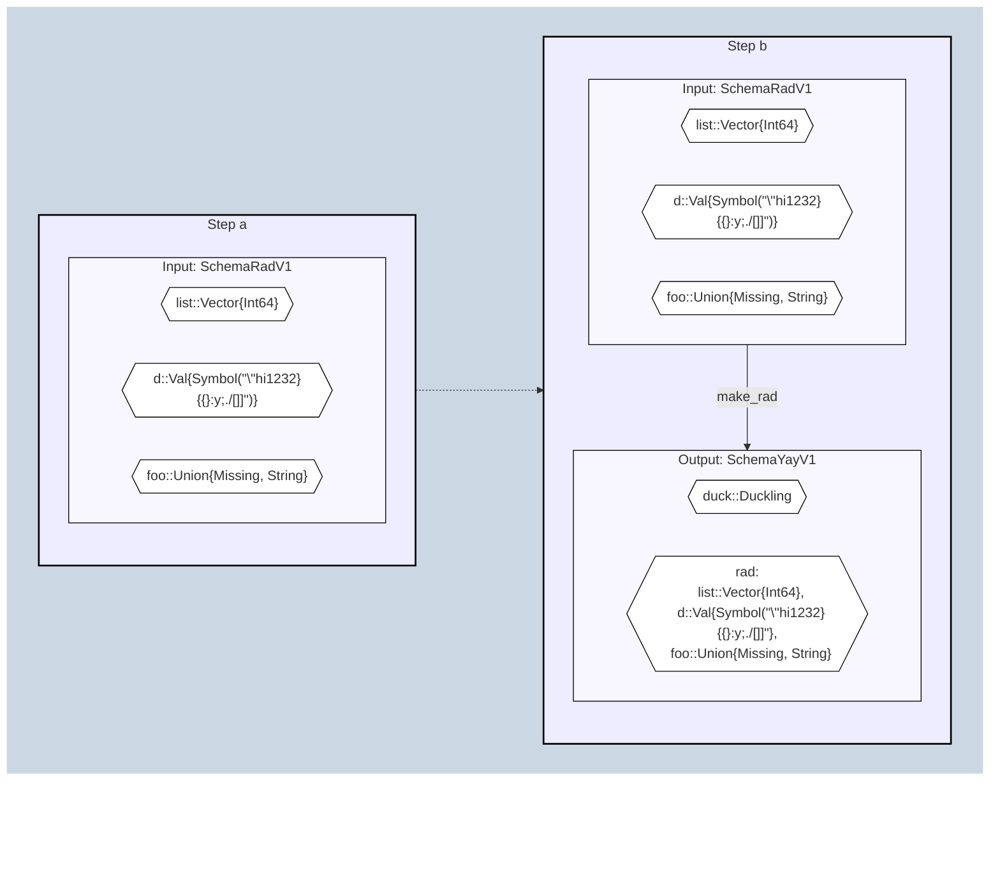

```mermaid
flowchart

%% Define steps (nodes)
subgraph OUTERLEVEL["` `"]
direction LR
subgraph STEP_A["Step a"]
  direction TB
  subgraph STEP_A_InputSchema["Input: SchemaRadV1"]
    direction RL
    STEP_A_InputSchemalist{{"list::Vector{Int64}"}}
    class STEP_A_InputSchemalist classSpecField
    STEP_A_InputSchemad{{"d::Val{Symbol(#quot;\#quot;hi1232}{{}:y;./[]]#quot;)}"}}
    class STEP_A_InputSchemad classSpecField
    STEP_A_InputSchemafoo{{"foo::Union{Missing, String}"}}
    class STEP_A_InputSchemafoo classSpecField
  end
  class STEP_A_InputSchema classSpec
end
subgraph STEP_B["Step b"]
  direction TB
  subgraph STEP_B_InputSchema["Input: SchemaRadV1"]
    direction RL
    STEP_B_InputSchemalist{{"list::Vector{Int64}"}}
    class STEP_B_InputSchemalist classSpecField
    STEP_B_InputSchemad{{"d::Val{Symbol(#quot;\#quot;hi1232}{{}:y;./[]]#quot;)}"}}
    class STEP_B_InputSchemad classSpecField
    STEP_B_InputSchemafoo{{"foo::Union{Missing, String}"}}
    class STEP_B_InputSchemafoo classSpecField
  end
  subgraph STEP_B_OutputSchema["Output: SchemaYayV1"]
    direction RL
    STEP_B_OutputSchemaduck{{"duck::Duckling"}}
    class STEP_B_OutputSchemaduck classSpecField
    STEP_B_OutputSchemarad{{"rad:
  list::Vector{Int64},
  d::Val{Symbol(#quot;\#quot;hi1232}{{}:y;./[]]#quot;},
  foo::Union{Missing, String}"}}
    class STEP_B_OutputSchemarad classSpecField
  end
  STEP_B_InputSchema:::classSpec -- make_rad --> STEP_B_OutputSchema:::classSpec
end

%% Link steps (edges)
STEP_A:::classStep -..-> STEP_B:::classStep

end
OUTERLEVEL:::classOuter ~~~ OUTERLEVEL:::classOuter

%% Styling definitions
classDef classOuter fill:#cbd7e2,stroke:#000,stroke-width:0px;
classDef classStep fill:#eeedff,stroke:#000,stroke-width:2px;
classDef classSpec fill:#f8f7ff,stroke:#000,stroke-width:1px;
classDef classSpecField fill:#fff,stroke:#000,stroke-width:1px;
```
