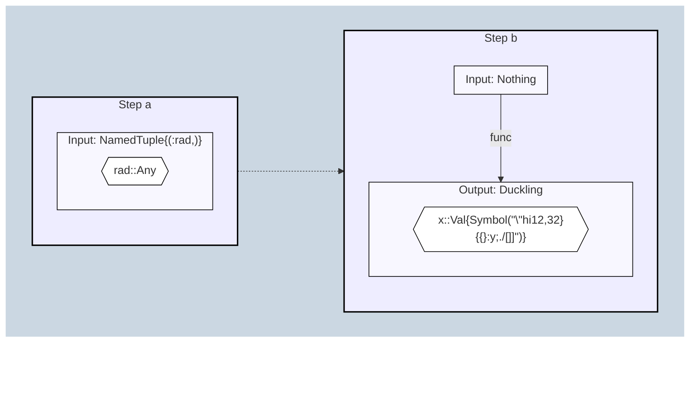

```mermaid
flowchart

%% Define steps (nodes)
subgraph OUTERLEVEL["` `"]
direction LR
subgraph STEP_A["Step a"]
  direction TB
  subgraph STEP_A_InputSchema["Input: NamedTuple{(:rad,)}"]
    direction RL
    STEP_A_InputSchemarad{{"rad::Any"}}
    class STEP_A_InputSchemarad classSpecField
  end
  class STEP_A_InputSchema classSpec
end
subgraph STEP_B["Step b"]
  direction TB
  subgraph STEP_B_InputSchema["Input: Nothing"]
    direction RL
  end
  subgraph STEP_B_OutputSchema["Output: Duckling"]
    direction RL
    STEP_B_OutputSchemax{{"x::Val{Symbol(#quot;\#quot;hi12,32}{{}:y;./[]]#quot;)}"}}
    class STEP_B_OutputSchemax classSpecField
  end
  STEP_B_InputSchema:::classSpec -- func --> STEP_B_OutputSchema:::classSpec
end

%% Link steps (edges)
STEP_A:::classStep -..-> STEP_B:::classStep

end
OUTERLEVEL:::classOuter ~~~ OUTERLEVEL:::classOuter

%% Styling definitions
classDef classOuter fill:#cbd7e2,stroke:#000,stroke-width:0px;
classDef classStep fill:#eeedff,stroke:#000,stroke-width:2px;
classDef classSpec fill:#f8f7ff,stroke:#000,stroke-width:1px;
classDef classSpecField fill:#fff,stroke:#000,stroke-width:1px;
```
