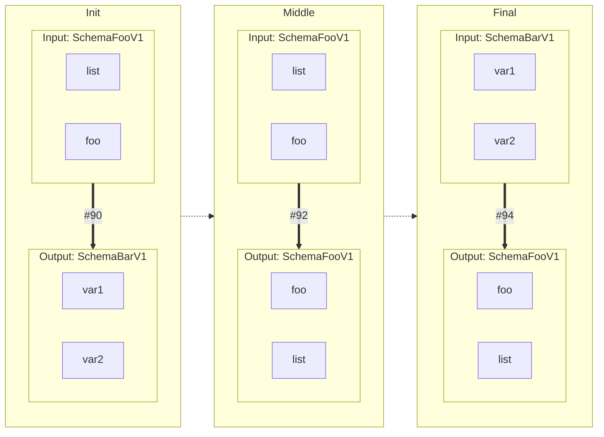

```mermaid
flowchart LR

%% Add steps (nodes)
subgraph INIT[Init]
  direction TB
  subgraph INIT_InputSchema[Input: SchemaFooV1]
    direction RL
    INIT_InputSchemalist[list]
    INIT_InputSchemafoo[foo]
  end
  subgraph INIT_OutputSchema[Output: SchemaBarV1]
    direction RL
    INIT_OutputSchemavar1[var1]
    INIT_OutputSchemavar2[var2]
  end
  INIT_InputSchema == #90 ==> INIT_OutputSchema
end
subgraph MIDDLE[Middle]
  direction TB
  subgraph MIDDLE_InputSchema[Input: SchemaFooV1]
    direction RL
    MIDDLE_InputSchemalist[list]
    MIDDLE_InputSchemafoo[foo]
  end
  subgraph MIDDLE_OutputSchema[Output: SchemaFooV1]
    direction RL
    MIDDLE_OutputSchemafoo[foo]
    MIDDLE_OutputSchemalist[list]
  end
  MIDDLE_InputSchema == #92 ==> MIDDLE_OutputSchema
end
subgraph FINAL[Final]
  direction TB
  subgraph FINAL_InputSchema[Input: SchemaBarV1]
    direction RL
    FINAL_InputSchemavar1[var1]
    FINAL_InputSchemavar2[var2]
  end
  subgraph FINAL_OutputSchema[Output: SchemaFooV1]
    direction RL
    FINAL_OutputSchemafoo[foo]
    FINAL_OutputSchemalist[list]
  end
  FINAL_InputSchema == #94 ==> FINAL_OutputSchema
end

%% Link steps (nodes)
INIT -.-> MIDDLE
MIDDLE -.-> FINAL

%% Link step i/o fields
```
