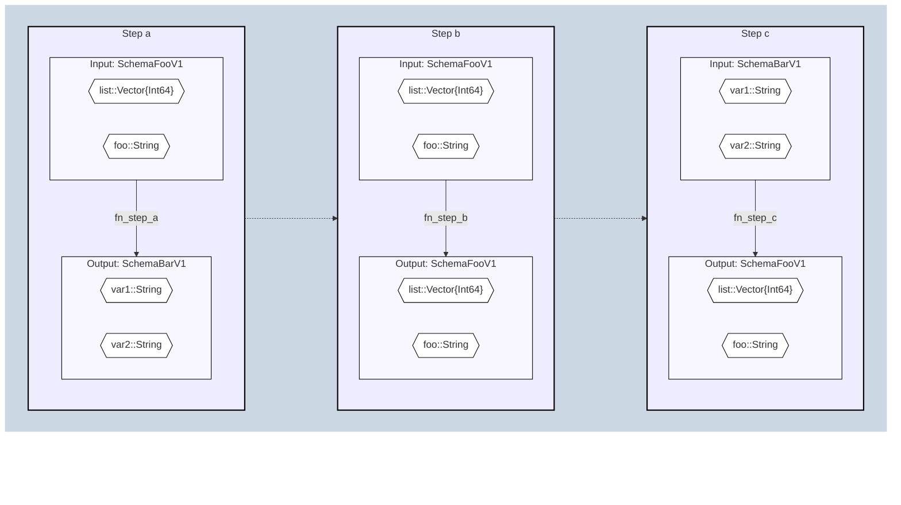

```mermaid
flowchart

%% Define steps (nodes)
subgraph OUTERLEVEL["` `"]
direction LR
subgraph STEP_A[Step a]
  direction TB
  subgraph STEP_A_InputSchema[Input: SchemaFooV1]
    direction RL
    STEP_A_InputSchemalist{{"list::Vector{Int64}"}}
    class STEP_A_InputSchemalist classSpecField
    STEP_A_InputSchemafoo{{"foo::String"}}
    class STEP_A_InputSchemafoo classSpecField
  end
  subgraph STEP_A_OutputSchema[Output: SchemaBarV1]
    direction RL
    STEP_A_OutputSchemavar1{{"var1::String"}}
    class STEP_A_OutputSchemavar1 classSpecField
    STEP_A_OutputSchemavar2{{"var2::String"}}
    class STEP_A_OutputSchemavar2 classSpecField
  end
  STEP_A_InputSchema:::classSpec -- fn_step_a --> STEP_A_OutputSchema:::classSpec
end
subgraph STEP_B[Step b]
  direction TB
  subgraph STEP_B_InputSchema[Input: SchemaFooV1]
    direction RL
    STEP_B_InputSchemalist{{"list::Vector{Int64}"}}
    class STEP_B_InputSchemalist classSpecField
    STEP_B_InputSchemafoo{{"foo::String"}}
    class STEP_B_InputSchemafoo classSpecField
  end
  subgraph STEP_B_OutputSchema[Output: SchemaFooV1]
    direction RL
    STEP_B_OutputSchemalist{{"list::Vector{Int64}"}}
    class STEP_B_OutputSchemalist classSpecField
    STEP_B_OutputSchemafoo{{"foo::String"}}
    class STEP_B_OutputSchemafoo classSpecField
  end
  STEP_B_InputSchema:::classSpec -- fn_step_b --> STEP_B_OutputSchema:::classSpec
end
subgraph STEP_C[Step c]
  direction TB
  subgraph STEP_C_InputSchema[Input: SchemaBarV1]
    direction RL
    STEP_C_InputSchemavar1{{"var1::String"}}
    class STEP_C_InputSchemavar1 classSpecField
    STEP_C_InputSchemavar2{{"var2::String"}}
    class STEP_C_InputSchemavar2 classSpecField
  end
  subgraph STEP_C_OutputSchema[Output: SchemaFooV1]
    direction RL
    STEP_C_OutputSchemalist{{"list::Vector{Int64}"}}
    class STEP_C_OutputSchemalist classSpecField
    STEP_C_OutputSchemafoo{{"foo::String"}}
    class STEP_C_OutputSchemafoo classSpecField
  end
  STEP_C_InputSchema:::classSpec -- fn_step_c --> STEP_C_OutputSchema:::classSpec
end

%% Link steps (edges)
STEP_A:::classStep -..-> STEP_B:::classStep
STEP_B:::classStep -..-> STEP_C:::classStep

end
OUTERLEVEL:::classOuter ~~~ OUTERLEVEL:::classOuter

%% Styling definitions
classDef classOuter fill:#cbd7e2,stroke:#000,stroke-width:0px;
classDef classStep fill:#eeedff,stroke:#000,stroke-width:2px;
classDef classSpec fill:#f8f7ff,stroke:#000,stroke-width:1px;
classDef classSpecField fill:#fff,stroke:#000,stroke-width:1px;
```
